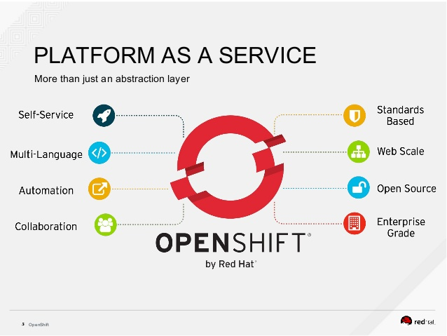
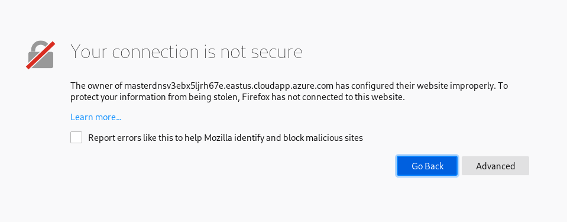
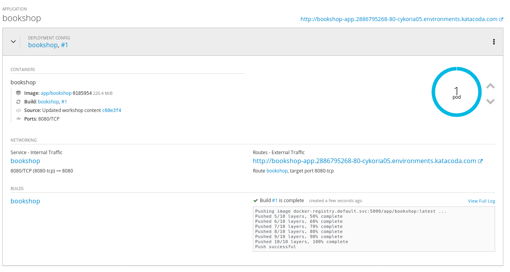
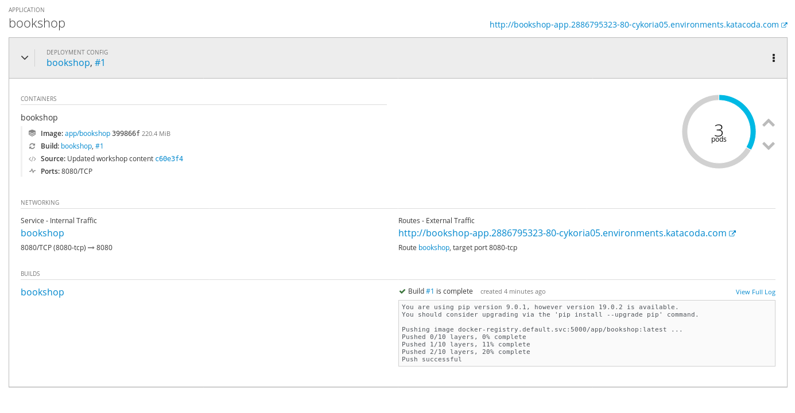
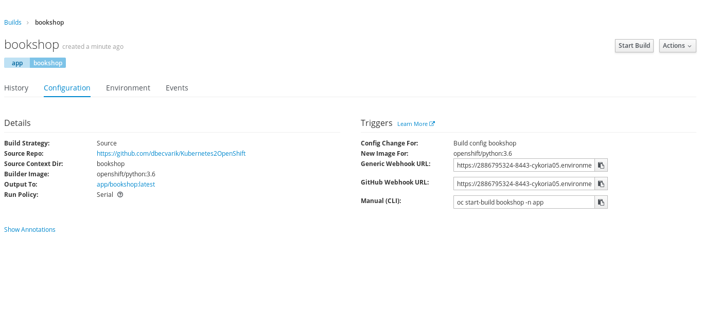
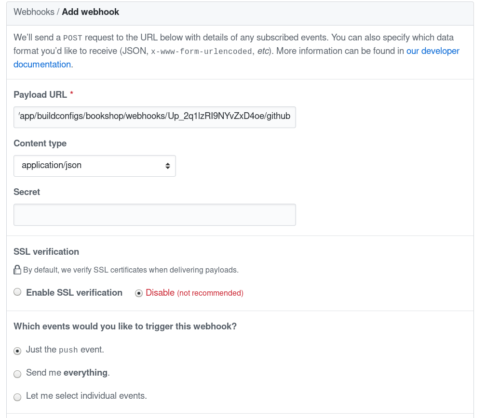
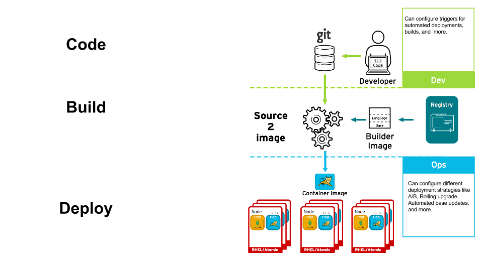
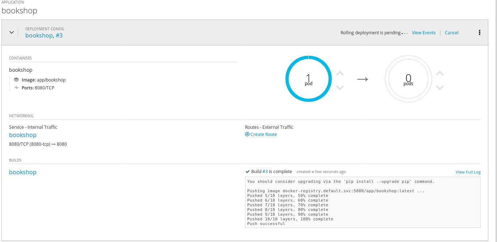

Objectives and pre-requisites
=============================

This document describes the introductory steps how to work with OpenShift Container Platform and its
BuildConfig and OpenShift pipelines. The purpose is to show how OpenShift extends Kubernetes.

You need to have an account on [GitHub](http://www.github.com/), If
you don't have one create a free account (<https://github.com/>).

The Lab challenges cover:

-   Introduction to OpenShift

-   Creating and managing OpenShift project


Introduction to openshift
=========================

[OpenShift](http://www.openshift.com) containers platform is Red Hat's Platform-as-a-Service (PaaS) on top of Kubernetes. 
It allows developers to quickly develop, host, and scale applications in a cloud environment and have Enterprise ready Kubernetes distribution. OpenShift offers multiple access modes including: developer CLI, admin CLI, web console and IDE plugins. Click2cloud is a plugin that allows Visual studio to deploy code to OpenShift, directly.



CHALLENGE 1: Create and manage projects 
=========================================

First we will learn how to create a project(namespace in Kubernetes). In  this challenge we will focus on the graphical portal.

To create an *application*, you must first create a new *project*, which will contain the application.

1.  From your browser, visit the OpenShift web console at *https://<MASTER_IP>:8443*. The web site, uses a self-signed certificate,
so if prompted, continue and ignore the browser warning.



1.  Log in using your username and password.

 

1.  To create a new project, click on blue *Create Project* button.

1.  Type a *unique* name, display name, and description for the new project.

1.  Click Create. The web console's welcome screen should start loading.

1.  Click on the project name in right column and examine your fresh project.


CHALLENGE 2: Create and manage Applications
============================================

Before we begin we will fork OpenShift example application on GitHub. We will use OpenShift
Django Example application as it is quick to build and easy to edit.

1.  Login to your *github* account, or create one if you didn't.

1.  Browse to *https://github.com/dbecvarik/Kubernetes2OpenShift* repository and fork it into your *github* account

1.  Download and install the OpenShift CLI related to your operating system. The easiest way to download the CLI is by accessing the About page on the web console if your cluster administrator has enabled the download links. Another alternative is to ssh into your bastion host that has the CLI tool installed already.

If you don't have a valid Red Hat subscription, you could still download the oc tool from: https://github.com/CCI-MOC/moc-public/wiki/Installing-the-oc-CLI-tool-of-OpenShift

1.  Use your openshift url endpoint to login to your environment from the CLI

``` bash
oc login https://...
The server uses a certificate signed by an unknown authority.
You can bypass the certificate check, but any data you send to the server could be intercepted by others.
Use insecure connections? (y/n): y

Authentication required for https://...
Username: ocpuser1
Password: 
Login successful.

You have one project on this server: "ocupser1"

Using project "ocupser1".
``` 

1.  Deploy bookshop application, replace $USER with your github username.

``` bash
oc new-app https://github.com/$USER/Kubernetes2OpenShift --context-dir=bookshop --name bookshop
```

When build is finished it should look like:



OpenShift leverages the Kubernetes concept of a pod, which is one or more containers deployed together on one host. A pod is the smallest compute unit that can be defined, deployed, and managed.

Pods are the rough equivalent of a machine instance (physical or virtual) to a container. Each pod is allocated its own internal IP address, therefore owning its entire port space. Containers within pods can share their local storage and networking.

While the Python *pod* is being created, its status is shown as pending.
The Python *pod* then starts up and displays its newly-assigned IP address. When the Python *pod* is running, the build is complete.

Pods have a lifecycle; they are defined, then they are assigned to run on a node, then they run until their container(s) exit or they are removed for some other reason. Pods, depending on policy and exit code, may be removed after exiting, or may be retained in order to enable access to the logs of their containers.

1. Make application available by exposing its service

``` bash
oc expose svc/bookshop
```

1. From the overview page, click the web address for the application in the upper right corner. Verify that the web application is up and available.


1.  Return to the *OpenShift* admin console. Browse to the project's overview page, and test scaling out and in your application by increasing or decreasing the number of *pods*, using the up and down arrow signs on the web console.
Scale out the app into 3 pods and watch the progress.


    
1.  Browse to Applications -> Pods, and make sure 3 pods serving the same application are now up and running.


1. Scale Application back to 1 Pod
    

CHALLENGE 3: Configuring automated builds
==========================================

Since we forked the source code of the application from the https://github.com/dbecvarik/Kubernetes2OpenShift, we can use a *webhook* to automatically trigger a rebuild of the application whenever code changes are pushed to the forked repository.

To set up a *webhook* for your application:

1.  From the Web Console, navigate to the project containing your application.

1.  Click the Browse tab, then click Builds -> Builds.

1.  Click your build name, then click the Configuration tab.

1.  Click next to GitHub webhook URL to copy your *webhook* payload URL.


 
1.  Navigate to your forked repository on GitHub, then click Settings.

1.  Click Webhooks and Click Add webhook.

1.  Paste your *webhook* URL into the Payload URL field.

1.  As Content Type choose application/json

1.  Disable SSL verification and click Add webhook to save.



1. Keep all the other parameters with the default values.

GitHub will now attempt to send a ping payload to your *OpenShift* server to ensure that communication is successful. If you see a green check mark appear next to your *webhook* URL, then it is correctly configured.

Hover your mouse over the check mark to see the status of the last delivery.


Next time you push a code change to your forked repository, your application will automatically rebuild.

CHALLENGE 4: Continuous deployment 
====================================

In this section, we demonstrate one of the most powerful features of *OpenShift*. We will see how we can trigger a continuous deployment pipeline, just by committing code change to Github.

Once there is a code change, the Github *webhook* will trigger the build of a new container image that combines a blueprint image from the registry with the updated code and generate a new image. This feature is called *S2I*, or source to image. Once the build finishes, *OpenShift* will automatically deploy the new application based on the new image. This capability enables multiple deployment strategies such
as A/B testing, Rolling upgrades...



1.  Use Azure cloud shell or install *Git* into your local machine

PS: If you don't want to use *git*, you still can perform this challenge by moving to step-5 and editing the *index.html* file , directly from the web interface of *github* and then go to step-7.
Create a "dev" folder and change into.

```bash
 $ mkdir dev && cd dev
```

1.  Clone the forked repository to your local system

```bash
 $ git clone https://github.com/<YourGithubUsername>/django-ex.git
```

1.  Make sure your local *git* repository is referencing to your
    *django-ex git*, on *github*:

```bash
 $ cd django-ex
```

```bash
 $ git remote -v
```

1.  On your local machine, use your preferred text editor to change the sample application's source for the file *welcome/templates/welcome/index.html*

Make a code change that will be visible from within your application.
For example: on line 215, change the title to "Welcome to your Django application on OpenShift on Azure!", then save your changes.

1.  Verify the working tree status

```bash
 $ git status
```

1.  Add config.ru content to the index, Commit the change in *git*, and push the change to your fork. You will need to authenticate with your *github* credentials


```bash
 $ git add welcome/templates/welcome/index.html
 $ git commit -m "Changed welcome message to reflect Azure runtime."
 $ git status
 $ git push
```

1.  If your *webhook* is correctly configured, your application will immediately rebuild itself, based on your changes. Monitor the build from the graphical console. Once the rebuild is successful, view your updated application using the route that was created earlier.
Now going forward, all you need to do is push code updates and OpenShift handles the rest.

1.  In an *Overview* view you can see your deployment beeing updated.


1.  In *Build->Build* view you can see details of your webhook build.


1.  From the web browser refresh the page and note the new change


1.  You may find it useful to manually rebuild an image if your *webhook* is not working, or if a build fails and you do not want to change the code before restarting the build. To manually rebuild the image based on your latest committed change to your forked repository:

    a.  Click the Browse tab, then click Builds.

    b.  Find your build, then click Start Build.
